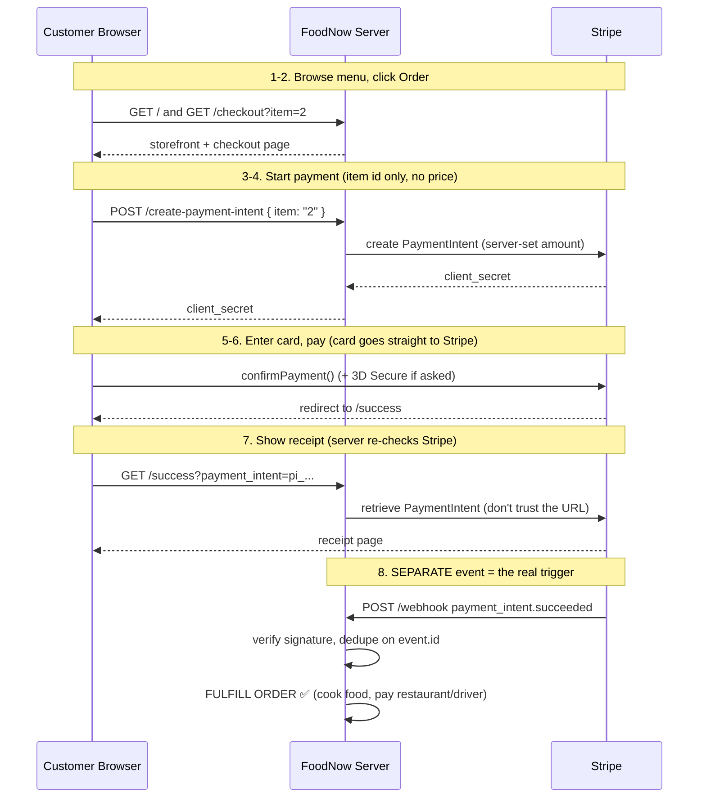

# FoodNow — Stripe Payments Demo (Test Mode)

A production-shaped payments demo for **FoodNow**, a fictional food-delivery
marketplace on AWS. A customer pays once; the platform keeps a fee; the
restaurant/driver get paid. **Stripe is the system of record and fulfillment
runs off events.**

Two runnable paths from the **same core code** (`src/core`):

- **Path A — Local:** Node.js + Express, for rehearsing.
- **Path B — AWS:** API Gateway + Lambda, native **Stripe → Amazon
  EventBridge** (no webhook server), DynamoDB idempotency, Secrets Manager.

> **Test mode only.** No live keys, ever.

---

## Repo layout
```
src/core/      shared money logic (cart, stripe client, payment intent, fulfillment)
local/         Path A — Express server + Payment Element checkout
aws/           Path B — AWS CDK (TypeScript) + Lambda handlers
specs/         spec-driven source of truth (FRs, NFRs, architecture, acceptance)
.claude/skills build-from-spec + verify-demo (the AI DLC workflow)
.env.example   placeholders only (copy to .env locally)
```

---

## Architect flow — what happens, step by step (no code knowledge needed)

This is the whole journey of one order, in plain English. Each row says **who
does what**, **what the system does**, and **which file runs**. Read it top to
bottom — it's the story you tell in an interview.

### The cast (who's involved)
- **Customer's browser** — shows the menu and the card form. Never trusted with the price.
- **FoodNow server** (`local/server.js`, or a Lambda on AWS) — owns the price, talks to Stripe.
- **Stripe** — takes the card, moves the money, and is the **system of record**.
- **The event** (`payment_intent.succeeded`) — Stripe's trustworthy "money moved" signal that triggers fulfillment.

### The happy path, as a picture



> The diagram renders automatically on GitHub. The same flow in plain text:
> ```
> Browser → Server: "I want item 2"   (no price!)
> Server → Stripe:  "charge $22.00"   (server sets the price)
> Stripe → Browser: card form → pay → redirect to /success  (just a screen)
> Stripe → Server:  payment_intent.succeeded EVENT  ← this cooks the food
> ```

### The happy path, step by step

| # | What the customer does | What the system does | Code that runs |
|---|---|---|---|
| 1 | Opens the site | Server reads the menu and renders the storefront grid | `GET /` → `getMenu()` in `src/core/cart.js` → `local/views/index.hbs` |
| 2 | Clicks **Order** on a dish | Server looks up that one dish and renders the checkout page; mints a one-time `checkoutSessionId` | `GET /checkout?item=2` → `getItem()` → `local/views/checkout.hbs` |
| 3 | (page loads) | Browser asks the server to start a payment — **sends only the item id, never a price** | `local/public/js/checkout.js` → `POST /create-payment-intent` |
| 4 | (waiting) | **Server sets the real amount** from the menu and asks Stripe to create a PaymentIntent; gets back a one-time `client_secret` | `createPaymentIntent()` in `src/core/paymentIntent.js` |
| 5 | Sees the card form | Browser mounts Stripe's Payment Element using the `client_secret` (card data goes straight to Stripe, never touches our server) | `checkout.js` → `stripe.elements()` |
| 6 | Enters card, clicks **Pay** | Browser tells Stripe to confirm. Stripe runs 3D Secure if the bank asks | `checkout.js` → `stripe.confirmPayment()` |
| 7 | Lands on success page | Browser is redirected to `/success`. Server **re-checks with Stripe** (never trusts the URL) and shows the receipt | `GET /success` → `paymentIntents.retrieve()` in `local/server.js` |
| 8 | (sees "order received") | **Separately**, Stripe sends the `payment_intent.succeeded` **event**. Server verifies it's really from Stripe, then fulfills **once** | `POST /webhook` → `constructEvent()` → `fulfillOrder()` in `src/core/fulfillment.js` |

### When a card is declined (the unhappy path)
At step 6, if the card is declined, Stripe returns the error to the browser
**before** any redirect. `checkout.js` shows the red message and re-enables the
Pay button. The customer **stays on checkout** — no `/success`, no event, **no
fulfillment**. (A decline emits `payment_intent.payment_failed`, which the
webhook handler ignores.) So a failed payment can never cook food.

### The two key truths to point at
- **Steps 7 and 8 are separate on purpose.** Step 7 (redirect) is just a screen
  for the human. Step 8 (event) is what actually cooks the food. If the browser
  closed after paying, step 8 *still happens* — the customer still gets fed.
- **The server owns the price** (step 4). The browser only ever names the dish.

### What changes on AWS (Path B) — same story, different plumbing
The steps are identical; only *where the code runs* changes:
- Step 3–4 (`/create-payment-intent`) runs in a **Lambda behind API Gateway**.
- Step 8 (the event) is delivered **natively by Stripe to Amazon EventBridge** —
  **there is no webhook server**. An EventBridge rule routes the event to a
  **fulfillment Lambda**, which dedupes in **DynamoDB**.

See the full mapping table near the bottom of this README.

---

## Path A — Run locally

### 1. Install + configure
```bash
npm install
cp .env.example .env
# edit .env: paste your Stripe TEST keys (sk_test_..., pk_test_...)
```

### 2. Start the server
```bash
npm start
# → FoodNow local demo running: http://localhost:4242
```

### 3. Forward webhooks with the Stripe CLI
In a second terminal:
```bash
stripe listen --forward-to localhost:4242/webhook
# copy the printed "whsec_..." into STRIPE_WEBHOOK_SECRET in .env, then restart npm start
```

### 4. Order + pay
Open http://localhost:4242 (use the port your terminal printed). You'll see the
**FoodNow storefront** (a menu grid). Click **Order** on a dish → the checkout
page mounts the Stripe Payment Element. Pay with a **test card** (any future
expiry, any CVC, any ZIP):

| Scenario | Card number | What you should see |
|---|---|---|
| ✅ **Success** | `4242 4242 4242 4242` | Payment succeeds → redirect to `/success` receipt. `FULFILL ORDER` logs (needs `stripe listen`). |
| ❌ **Generic decline** | `4000 0000 0000 0002` | Red error on the checkout page, button re-enables, **no redirect**, **no fulfillment**. |
| 💸 Insufficient funds | `4000 0000 0000 9995` | Decline error: insufficient funds. |
| 📅 Expired card | `4000 0000 0000 0069` | Decline error: expired card. |
| 🔢 Incorrect CVC | `4000 0000 0000 0127` | Decline error: incorrect CVC. |
| 🔐 **3D Secure (auth)** | `4000 0027 6000 3184` | A bank "verify it's you" popup appears → **Complete** = success, **Fail** = decline. |
| 🔐 3D Secure 2 | `4000 0000 0000 3220` | Modern 3DS2 challenge popup. |

On success, Stripe redirects to `/success`, which retrieves the PaymentIntent
and shows a receipt — and explains it did **not** fulfill the order. The
**`FULFILL ORDER — paymentIntent=pi_... amount=...`** line in the server terminal
came from the **webhook event**, not the redirect.

> The browser only ever sends the **item id** — the server looks up the price
> from `src/core/cart.js`, so the amount can't be tampered with.
> Full list of test cards: <https://docs.stripe.com/testing>.

### 5. Prove idempotency
```bash
stripe events resend <evt_id>   # id shown in the stripe listen output
# → server prints "Duplicate event ... ignored", no second FULFILL
```

### 6. (Optional) Connect split
Set `CONNECTED_ACCOUNT_ID=acct_...` in `.env` and restart. The payment becomes
a **destination charge**: FoodNow keeps 20%, the rest goes to the connected
account. Verify the application fee on the PaymentIntent in the Dashboard.

---

## Path B — Deploy to AWS (CDK)

> Account `<YOUR_AWS_ACCOUNT_ID>`, region `us-east-1`, Node 20. You run these commands
> with your own AWS credentials. The demo never deploys on its own.

### 1. Bootstrap + first deploy
```bash
cd aws
npm install
npx cdk bootstrap aws://<YOUR_AWS_ACCOUNT_ID>/us-east-1   # once per account/region
npx cdk deploy
```
Outputs include `ApiUrl`, `StripeSecretArn`, `IdempotencyTableName`, and a
`NextStep_RegisterStripe` note.

### 2. Put the Stripe TEST secret key into Secrets Manager
```bash
aws secretsmanager put-secret-value \
  --secret-id foodnow/stripe-secret-key \
  --secret-string '{"STRIPE_SECRET_KEY":"sk_test_xxx"}' \
  --region us-east-1
```

### 3. Create the event destination in Stripe (Workbench)
Follow Stripe's flow: <https://docs.stripe.com/event-destinations/eventbridge>.
First **enable Workbench** (Developer settings) — no events arrive until every
step below is done.

In **Workbench → Webhooks tab → Create new destination**:
- Event source: **Your account** (or **Connected accounts** for the Connect demo).
- Event types to send: **`payment_intent.succeeded`** (add more later if needed).
- Destination type: **Amazon EventBridge**.
- **AWS account ID:** `<YOUR_AWS_ACCOUNT_ID>`  ·  **AWS region:** `us-east-1`.
- Click **Create destination**.

Stripe then creates a **partner event source** in your AWS account. Copy the
**Event Source ARN** shown in Workbench — the bus name is the
`aws.partner/stripe.com/<id>` portion.

### 4. Associate the partner source with an event bus (AWS console)
> Do this **within 7 days** or AWS deletes the pending source (which disables
> your Stripe destination and forces you to recreate it).

**EventBridge → Integration → Partner event sources** → select the same
**region** → pick the new `aws.partner/stripe.com/<id>` source →
**Associate with event bus** → grant permissions → **Associate**.
(The bus name ends up identical to the source name.)

### 5. Redeploy so the CDK rule attaches to the partner bus
```bash
npx cdk deploy -c partnerEventBusName=aws.partner/stripe.com/<id>
# add -c connectedAccountId=acct_xxx to enable the Connect split on AWS
```

### 6. Verify on AWS
- Trigger a snapshot event: `stripe trigger payment_intent.succeeded`
  (or pay through `{ApiUrl}/create-payment-intent` from a checkout page).
- Watch the **fulfillment Lambda's CloudWatch Logs** for `FULFILL ORDER`.
- **Replay** the event in Stripe → the DynamoDB conditional write blocks a
  second fulfillment ("Duplicate event ... ignored").

> **Note on retries & ordering (per Stripe docs):** EventBridge delivery
> retries with backoff for up to ~3 days, but **manual retries aren't
> supported** and **event order isn't guaranteed** — which is exactly why
> fulfillment is idempotent and never assumes ordering.

---

## End-to-end test: real payment → EventBridge → Lambda

This proves the whole point of Path B: **a real payment made in the browser
fulfills the order on AWS — without the website ever calling AWS.** The local
storefront and the AWS path share one Stripe account, so any successful payment
emits `payment_intent.succeeded` account-wide, and Stripe's EventBridge
destination delivers it to your AWS bus.

### 1. Watch the AWS fulfillment Lambda (Terminal 1)
```bash
aws logs tail /aws/lambda/<FulfillmentFnName> --follow --region us-east-1 --format short
# the function name is in `npx cdk deploy` outputs / the Lambda console
```
Leave it running. Nothing here is local — these are AWS CloudWatch Logs.

### 2. Pay through the website (browser)
1. Open the local storefront: <http://localhost:4242> (or the port `npm start` printed).
2. Click **Order** on a dish, then pay with **`4242 4242 4242 4242`** (any
   future expiry, any CVC, any ZIP).
3. You land on the `/success` receipt page.

### 3. Confirm the chain fired
Within a few seconds, Terminal 1 prints:
```
FULFILL ORDER — paymentIntent=pi_xxx amount=22.00 USD
```
The `pi_xxx` matches the PaymentIntent on your `/success` receipt. The website
never told AWS anything — the **event** did. If the browser had closed right
after paying, this **still** fires. The event cooks the food, not the redirect.

```
You pay on the website
  → Stripe creates the PaymentIntent
  → Stripe emits payment_intent.succeeded (account-wide)
  → Stripe's EventBridge destination → your AWS partner bus
  → EventBridge rule → fulfillment Lambda → FULFILL ORDER ✅
```

### 4. Prove idempotency (no double-cooked orders)
Stripe delivers **at-least-once**, so the same event can arrive twice. Invoke the
Lambda twice with the **same Stripe event id** and watch only ONE fulfillment:
```bash
cat > /tmp/idem-test.json <<'JSON'
{ "detail-type": "payment_intent.succeeded",
  "detail": { "id": "evt_idem_demo_001", "type": "payment_intent.succeeded",
    "data": { "object": { "id": "pi_idem_demo_001", "amount": 2200, "currency": "usd" } } } }
JSON

aws lambda invoke --function-name <FulfillmentFnName> --region us-east-1 \
  --cli-binary-format raw-in-base64-out --payload file:///tmp/idem-test.json /tmp/out1.json
cat /tmp/out1.json   # {"fulfilled":true}

aws lambda invoke --function-name <FulfillmentFnName> --region us-east-1 \
  --cli-binary-format raw-in-base64-out --payload file:///tmp/idem-test.json /tmp/out2.json
cat /tmp/out2.json   # {"duplicate":true}
```
CloudWatch shows **one** `FULFILL ORDER` and then `Duplicate event evt_idem_demo_001
ignored (already fulfilled).` The Lambda's first step is a DynamoDB conditional
write (`attribute_not_exists(eventId)`) — the first call claims the id and
fulfills; any duplicate fails the condition and is skipped. It's one atomic
write, so even a same-millisecond race can only fulfill once.

> **Why this design:** EventBridge gives no ordering guarantee and no manual
> retry, so duplicates *will* happen in production. We don't try to stop them
> arriving — we make processing them **safe**. Idempotency lives at the
> consumer, not as hope at the producer.

---

## Local → AWS mapping

| Concern | Path A (local) | Path B (AWS) |
|---|---|---|
| Create PaymentIntent | Express `POST /create-payment-intent` | API Gateway + Lambda |
| Receive Stripe events | `stripe listen` → `POST /webhook` | **Stripe native → EventBridge** (no server) |
| Trust the event | verify `stripe-signature` on raw body | trusted Stripe **partner event bus** |
| Idempotency | in-memory `Set` on `event.id` | **DynamoDB** conditional write on `eventId` |
| Stripe secret | `.env` (gitignored) | **Secrets Manager**, read at runtime |
| Fulfillment output | `console.log` | **CloudWatch Logs** |
| Server-set amount | `src/core/cart.js` | `src/core/cart.js` (same code) |

---

## What to say while demoing

1. **"The amount is set on the server."** Open `src/core/cart.js`. The browser
   POSTs an empty body; the server computes the total. A user can't pay $0.01
   for a $40 order.
2. **"Stripe is the system of record; fulfillment runs off events."** Pay with
   4242, land on the success page — then point out the success page itself says
   it did *not* fulfill. The `FULFILL ORDER` log comes from the webhook event.
3. **"Why events, not the redirect?"** A browser can close or be faked. The
   `payment_intent.succeeded` event is the trustworthy "money moved" signal.
4. **"On AWS there's no webhook server."** Stripe delivers natively to
   EventBridge; a rule routes `payment_intent.succeeded` to a Lambda. Less to
   host, patch, and scale.
5. **"It's idempotent."** Replay the event. Local uses a Set; AWS uses a
   DynamoDB conditional write on `event.id`. No double-cooked orders, no double
   payouts.
6. **"And it's a real marketplace."** Flip on `CONNECTED_ACCOUNT_ID`: one
   payment splits to the restaurant/driver with a 20% platform fee retained.
7. **"The process is spec-driven."** `/specs` is the source of truth; the
   `.claude/skills` codify build-from-spec and verify-demo — the AI development
   lifecycle that produced this.

---

## Security notes
- **Test mode only.** The code rejects `sk_live_` keys at startup.
- Secrets never live in code or git: `.env` (gitignored) locally, Secrets
  Manager on AWS. Only the **publishable** key reaches the browser.
- The local `/webhook` **verifies the Stripe signature** before acting. The AWS
  path trusts the authenticated Stripe partner event bus instead.
- If you ever pasted a real key into `sample.env`, **roll it** in the Stripe
  Dashboard.

## Verify before an interview
Run the `verify-demo` skill (or follow `specs/04-acceptance-criteria.md`) to get
a pass/fail checklist across both paths.
